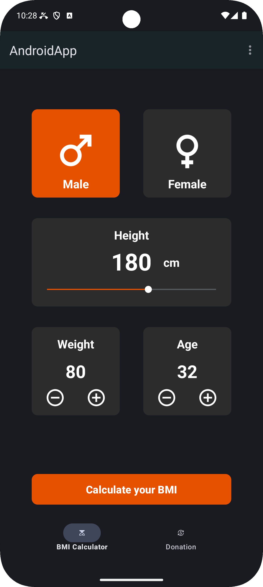
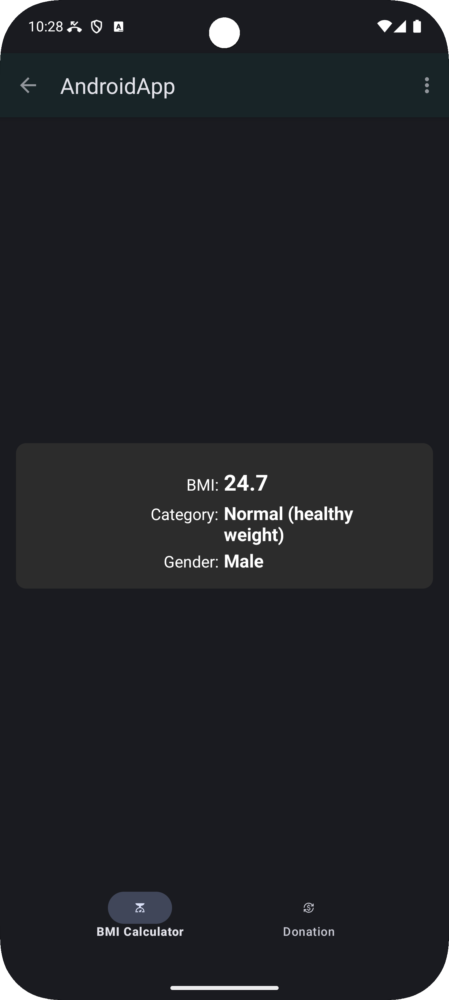
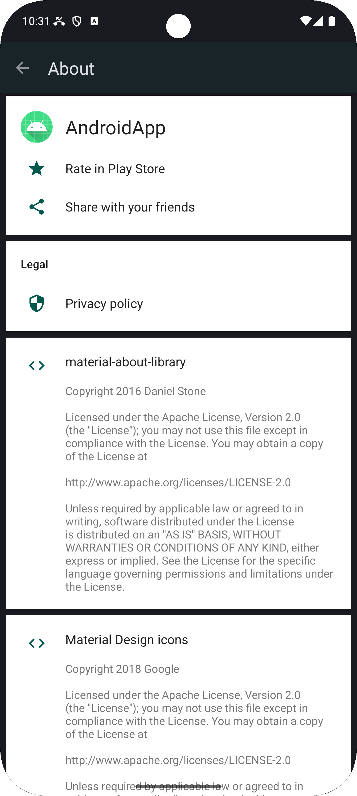

# LF-ZQ16A_AndroidApp

## TechStack
- Android Studio IDE
- Java Programming Language

## Screenshots

   

## Installation
To set up the project locally, follow these steps:
1. **Clone the Repository**: Use the following command to clone the repository to your local machine:
   ```bash
   git clone https://github.com/bobby-bloom/LF-ZQ16A_AndroidApp.git
   ```
2. **Open in Android Studio**: Launch Android Studio and open the cloned project.
3. **Build the Project**: Click on the "Build" menu and select "Rebuild Project" to resolve dependencies and prepare the application for running.

## Usage
The application consists of two main functionalities:
- **BMI Calculation**: Users can input their height, weight, and age to calculate their BMI. The application provides immediate feedback as users adjust their inputs using sliders and buttons.

## License
UNLICENSE for this repository (see UNLICENSE.txt for more details)
